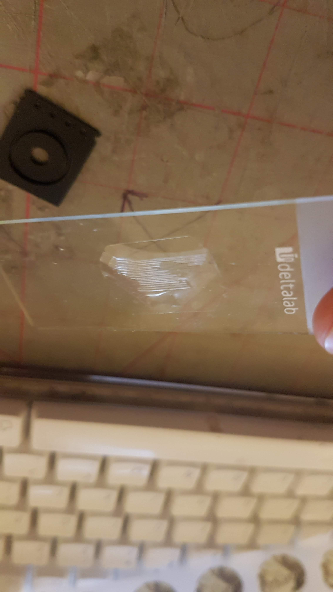
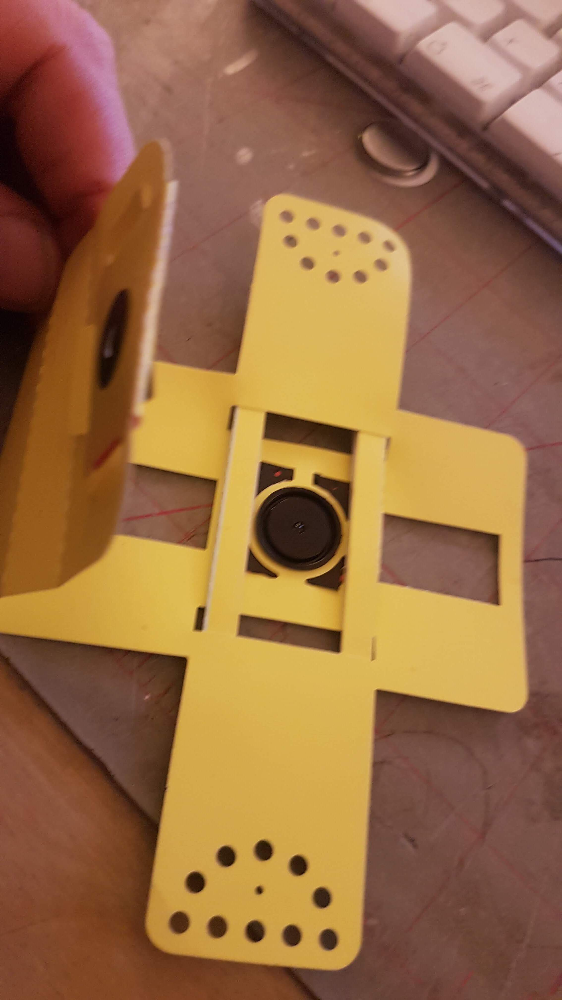
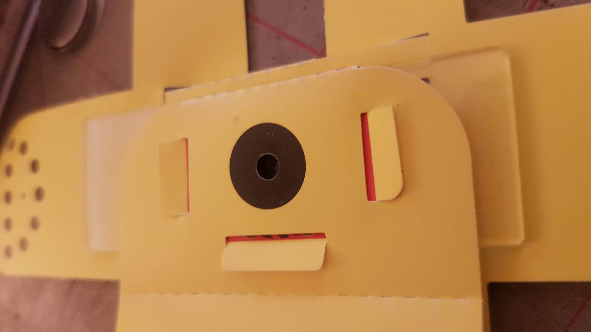
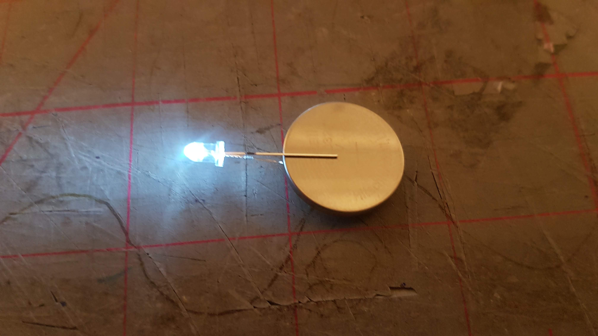

## Lab-From-A-Chip

Lab-from-a-chip is a family friendly DIY intervention in Lab On A Chip technology using model organisms inspired by Science and Technology studies and scientific practice and part of Ross Dalziel's PhD research Critical Kits at the [Division for BioMedical Life Sciences at Lancaster University (BLS)](https://www.lancaster.ac.uk/biomedical-and-life-sciences/) and makerspace [DoESLiverpool](https://www.lancaster.ac.uk/biomedical-and-life-sciences).

*"A* ***lab-on-a-chip*** *is a device that integrates one or several laboratory functions on a single integrated circuit of only millimeters to a few square centimeters to achieve automation and high-throughput screening."* via [Wikipedia](https://en.wikipedia.org/wiki/Lab-on-a-chip)

## Features

 * Hard silicon timer chips, the logical oscillating workhorses that make the world tick!
 * Stretchy see-through silicon polymers!
 * Lithium!
 * Model Organisms, Biology's non-human collaborators!
 * [Leeuwenhoek](https://en.wikipedia.org/wiki/Antonie_van_Leeuwenhoek) Microscopes made of paper with lenses ground in China on a tape reel just like electronic components!
 * The redundant media of Vinyl records!
 * Diodes!
 * Feminist technoscience!
 * Critters that move like animals but eat like plants!
 * Making moulds from the capitalist ruins!

## Making Lab On A Chip DIY

I'm interested in what happens when you take a system from science and engineering, what Science and Technology Studies (STS) calls 'technoscience' and try to make it something that can be done outside of the "secluded research" (Callon et al. 2009. *Acting in an uncertain world : an essay on technical democracy* USA: MIT Press.)of the science lab; how you could turn it into a DIY kit, what that entails and what that might mean.

It follows some [diverse approaches to DIY Microfluidics like this](http://fab.cba.mit.edu/classes/S62.12/people/tsai.liz/index.html), then follows the novel practices of people at BLS.

I then take all kinds of ideas from STS and feminist technoscience to make a [Theoretical Repertoire](#theoretical-repertoire-book-package) to make a workshop exploring model organisms in DIY environments made from discarded domestic electronics and media.

Jump to [Getting Started](#getting-started) to get going

## Bridging The World-To-Chip Barrier

*"Microfluidic devices are an enabling technology for many labs, facilitating a wide range of applications spanning high-throughput encapsulation, molecular separations, and long-term cell culture. In many cases, however, their utility is limited by a ‘world-to-chip’ barrier that makes it difficult to serially interface samples with these devices."*

(Longwell, Scott A, and Fordyce, Polly M. 2019. *micrIO: an open-source autosampler and fraction collector for automated microfluidic input–output* London Royal Society of Chemistry)

This world and it's related fields of engineering of pico, nano and microfluidics can be hard to get into. Engineering structures only a few tens of microns high are hard and expensive to make. This project tries to take a playful approach to fostering agency and embodied thinking about this technology and bringing silicon and big living collaborating proteins together.

Inspired and re-empracticed from microbiologist researcher, biotechnologist and engineer [Alexandre Benedetto](https://www.lancaster.ac.uk/health-and-medicine/about-us/people/alexandre-benedetto) and in turn inspired by an article in [The Worm Breeders Gazette](http://wbg.wormbook.org/2017/07/18/immobilizing-nematodes-for-live-imaging-using-an-agarose-pad-generated-with-a-vinyl-record/)

Alex and his research students research the ageing process in Nematode model organisms. There's an interesting story to how these worms became such important non-humans [here](https://bigpictureeducation.com/model-organisms-genetics-research-nematode-worm) He uses the grooves of old vinyl records as moulds for PDMS silicon which centrifuged and de-gassed provides optically clear environments for securing nematodes for the observation of gene expression.  

We realised we are already surrounded by exotic objects that are made of very small engineered structures: the tiny logos etched onto integrated circuits in our phones or humble doorbell, or the tiny grooves of a vinyl record. All you need is some Polydimethylsiloxane (PDMS) a *silicon polymer* that is inert, non-toxic and optically clear to use these exotic objects to manipulate living organisms.

What these chips really depend on is microfluidics, a development from electronic circuits but with things much bigger than electrons, the big molecules of chemistry and biology.

*"Microfluidic devices are powerful tools for biology, chemistry, and medicine, with applications including biomolecular characterization, cell encapsulation and culture, particle synthesis, and diagnostics. In theory, their miniature scale allows a researcher to integrate processes that span several lab benches into a single device with minimal cost and sample requirements. In reality, the extensive infrastructure required to convey reagents, samples, and analytes into and out of devices often renders a ‘lab-on-a-chip’ more of a ‘chip-in-a-lab"*
(Ibid.)

Making this technology involves dust free environments, vacuum systems and expensive photolithography to get it done 'right'. But this usually does not stop the DIY 'maker' impulse. Even [Scanning Tunneling Microscopes (STM)](http://dberard.com/home-buit-stm) have gone DIY. There is alot of open source work going on in the microfluidic community, not necessarily DIY, but I'm exploring how makerspaces can engage with it. 

In experimenting with DIY microfluidics I hope to

* Teach what microfluidics really are away from the master hyperbolic sales talk of Lab on A Chip.
* Explore 'agency' and the power relations and subjectivities so other actors can explore the field
* See what is going on in the technology

Make a *"frame for recovering the heterogeneous relations that technologies fold together...open(s) received and/or congealed relations to be(ing) re-enacted differently"* as Suchman says.

### Getting started

#### Make A PDMS Mould

* Get a small blob of `A` PDMS in cover of the petri dish (the shallow side)
* Get a small blob of `B` PDMS in cover of the petri dish
* Mix together with edge of a paper slide from the foldscope net.
* Dip the `555` timer chip gently top first into the mix. Remove excess.
* Brush some PDMS mix onto the vinyl record
* Leave to dry
* Cover the `555` timer with the deeper side of the dish to avoid dust.

#### Quick Foldscope Assembly :microscope:

We are going to do a quick build of a  [Foldscope](https://www.foldscope.com/) Prakesh Labs ingenious bit of microengineering for frugal science.

1. Open up your foldscope kit and open the instructions. We are going to just build the lens stage and focus ramp, a minimal build to look at some algae and make moulds and connect to our phone cameras. Steps 1 - 6, and step 10. of the **ASSEMBLY INSTRUCTIONS**
   1. Insert coupler into Lens stage
   1. Insert another coupler into the reverse of the stage
   1. Fold and lock the bottom flap
   1. Insert lens into the Lens stage.
   1. Fold the Focus ramp
   1. Insert ramp into stage
   1. Fold the bottom of the Lens stage.

#### Connect to phone. :phone: :camera:

Refer to **Phone View** in **VIEWING** section overleaf.

1. Take the round white double sided peel off sticker and stick it carefully over your phone camera lens, make sure you dont get the glue on the lens. It comes off with water if you do :smile:

2. Remove the white cover. Now theres a sticky side facing up.

3. Take the other coupler and place it silver side down over the lens. Keep the lens central to the couplers hole.

#### Slide prep :bug:

1. Carefully with tweezers peel off the cured PDMS from your `555` timer chip in the petri-dish and place it so where it came into contact with the surface is flat on the surface of the slide, in the centre of the glass with the slide logo ledgible

2. Take a micropipette and place the long tip from your kit on the end.
3. Press and hold the button/plunger.

4. Get a friend to open and hold the 1.5ml Eppendorf tube with the algae suspension inside.
5. Insert tip into the Eppendorf tube
6. Release the plunger, it will have captured the number of micro litres indicated on the pipette of algae suspension
7. place the tip by the side of the tiny section of silicon.
8. Press the button to eject the algae suspension, it should find it's way under the PDMS slab by capillary action
9. Peel off the clear sticky cover slip and place over the slab. If your slab is too thick, dont bother.

#### Viewing :eyes:

1. Open & hold the rear flap, so the yellow side of the stage faces up
1. Take your prepared slide and place cover slip or slab down over the tiny bubble of the ball lens.

3. Let the bottom lens stage flap magnetically snap to hold the slide in place.
4. Carefully turn over keeping slide in place. Use stickers if it slips. The blue side should face up
5. Slide the focus ramp out so the `Z` mark on the stage lines up with the `0` on the focus ramp rule.
6. Place on the desk with silver of coupler facing up
7. Turn on your phone camera and slowly approach the coupler, the magnetic force whould make the stage jump up onto your phone.
8. Watch and explore! Check your mould is in place, experiment with the focus and move around toward the light. Face a window or light or use the LED & Battery

## Theoretical Repertoire :book: :package:

In my research on kit culture, I try to build up a theoretical repertoire for tuning into what might be going on across various forms of biological knowledge production, then use this repertoire to make kits, a kind of `critical-making`. 

These kits then become handy "boundary objects", objects that people from different disciplines or practices can use or understand, for exploring further and more intimately, growing the repertoire, making more kits with more people and so on. In my case they allow an artist doing research, 'laypersons'(different 'publics') and 'specialists'(scientists and their students) understand each other.

But also and this is what I now understand as a big part of my artistic practice and the practice of [Domestic Science](https://domesticscience.org.uk/about.html), most commonly the kits and activities I make and facilitate become objects to talk over and around. 

I build the repertoire by reading through making, making through reading and talking.

 * Review a range of kit and kit like practices that condense into a [Library of kits](https://domesticscience.org.uk/criticalkits/Library.html), a kit literature.
 * Briefly review literatures of the history of the philosophy of science in response to practices and kits I make with people.
 * Review literatures in STS Method, structured by emerging kits.

 With this repertoire and armed with my boundary negotiating kits:

 * Observe Craft practices in teaching microbiology undergraduates at the Division for Biomedical Life Science at Lancaster University
 * Observe me making kits with researchers and students
 * Making kits and facilitating activity based on them in makerspace DoESLiverpool and other sites in the worlds related to my art practice.

### Imaginaries

STS method includes the use of ethnographic or other styles of 'case study'. This kit is one such emerging case. Ideas like socio technical imaginaries are relevant when thinking about what is really going on in powerful ideas like ***Lab on a chip***

*"Throughout the modern world, science and technology (S&T) are deeply implicated in producing collective visions of good and attainable futures. These “sociotechnical imaginaries” have proved particularly useful for policymakers in late modern societies. Imagined futures help justify new investments in S&T; in turn, advances in S&T reaffirm the state’s capacity to act as responsible stewards of the public good. Sociotechnical imaginaries serve in this respect both as the ends of policy and as instruments of legitimation.*

*...but other imaginaries are also often at play in the world, based on different cultural understandings of the good life. Public hopes and fears concerning S&T engage in unpredictable ways with forms of imagination current in policy worlds. Publics also construct and act upon their own imaginaries of those in power and hold policymakers responsible in accordance with their tacit or explicit notions of discovery, innovation, efficiency, progress, uncertainty, evidence, argument, value, legitimation.*

*Another way to understand a concept is to see how it works alongside others....imaginaries help explain why, out of the universe of possibilities, some envisionings of scientific and social order tend to win support over others—in other words, why some orderings are co-produced at the expense of others."*

From [The Sociotechnical Imaginaries Project](http://sts.hks.harvard.edu/research/platforms/imaginaries/)

### The Lab-On-A-Chip Imaginary

Lab on a chip tech builds an interesting 'public imaginary', a narrative for both layperson and specialist, as a form of biological or chemical manufacturing akin to the so called silicon 'revolution'.

Like Integrated circuits they are very small environments for manipulating and interpreting the behaviour of matter. Like their silicon cousins they generate alot of hype, hope, fear, hard cash and financialisation and hopefully something 'good'.

Unlike these circuits, lab-on-a-chips manipulate much bigger things than electrons, big, scary molecules just as weird as any tiny quantum packets, but so complicated it can make your head spin as fast as an accountant at the Large Hadron Collider: big proteins like DNA, bioassays and super collaborating symbiotic mega-communities which have the added complication of not only ***being alive*** but containing mind boggling histories encoded inside every part of them.

What **Lab on a chip** imaginaries are made?

 * Scalable distributable labs that work 'on their own'
 * Disrupting the field of bio and chemical manufacturing
 * Somehow it's intelligent, and automated
  * Labs can work 'anywhere'
  * Labs are small but powerful
  * Myths of new biological computers made by existing biological computers
  * These are like kits: they package up some bio processes and make them super mobile and easy
  * They are going to 'revolutionise' access to the industry, which you can see in the [Metafluidics](https://metafluidics.org/)    
  * Realise the genetics-to-order shop scenes of science fiction like Bladerunner etc.  
  * It has all the intersections of biology, engineering, well meaning utility and agency for frugal science in 'intractable' places

### Invisible Work

*"I took exception to a comment on maker education twitter a while back that kits used in tech education workshops are a great idea because they ‘save time’ in workshops; this could not be further from the truth. That well meaning comment unintentionally reveals what’s missing in understanding kits and by extension the whole maker meme and from there, other creative practice that uses technology in social settings: The care, thought, iterative failure, maintenance and communal resilience required for their success."*

[My blog on Critical Kits](http://cheapjack.github.io/2018/07/05/critical-kit-resilience)

This chimes with Susan Leigh Stars description of the invisible work that goes on behind scientific facts and products

*"People may see a map of a genome or a syringe full of experimental medication. These are just the end products, however, of a web of relationships, what Lave and Wenger have called communities of practice. Lave and Wenger make the strong claim that membership in these communities constitutes learning and science (Adler and Obstfeld, in press; Bowker and Star, 1999: Chapter 10; Lave and Wenger, 1991; Obstfeld, 2005). These relationships are usually invisible to readers of science and technology (Star and Strauss, 1999; Suchman, 1987)."* 

(Bryant, Anthony. Charmaz, Kathy ed. (2011) *The SAGE handbook of grounded theory* Los Angeles: Sage

*"Scientific journals are full of articles that delete the development, setting, communication practices, and ‘grunt work’ involved in doing science. "*

(Ibid.)

#### Configuration

***Configuration*** takes these imaginaries further and feel particularly relevant to the 'invisible work' and 'talking' that are bound up in science, technology and kit making 

*"drawing our analytic attention to the ways in which technologies materialize cultural imaginaries, just as imaginaries narrate the significance of technical artefacts."* 

*""Configuration, I have suggested here, is part of a toolkit for thinking about constitutive and generative, reiterative and (potentially) transformative material-semiotic conjoining. In the case of technology, configuration orients us to the entanglement of imaginaries and artefacts that comprise technological projects.*

*While normative methods are designed to define and police boundaries, configuration as a method assemblage aims to articulate method in a way that opens received and/or congealed relations to being re-enacted differently (see Law, 2004: 84)."*

(Suchman, Lucy. *In Lury, C. and Wakeford, N. eds. (2012) Inventive methods: The happening of the social.* London: Routledge. pp. 62-74.)

## Inspiring Interventions

[Mikroskopisk PacMan](https://youtu.be/GvZm9EXqrdU) Erik Andrew Johannessen's high end microfluidics game is worth looking at for a playful exploration. Check out the [full video here](https://www.youtube.com/TVxNvWCTbYo) and read the [Vice article](https://www.vice.com/en_us/article/vv7zba/pac-man-inspires-norwegian-researchers-to-better-study-microorganisms) if you like that kind of thing. Back in the 1960s when the military funded the shrinking of transistors nobody thought they'd use it for fun with ghosts, stories and pictures of cats, just bombs and tracking communists, but just look at the weird cultures that turned into! I wonder where microfluidics will take us? Should we be even doing this? What knowledge and 'goods' does it make?  

Helen Pritchard's [Critters on a chip](http://www.helenpritchard.info/artworks-projects/critter-compiler-prototype-2016) suggests we might get organisms in microfluidic environments writing code and literature.
