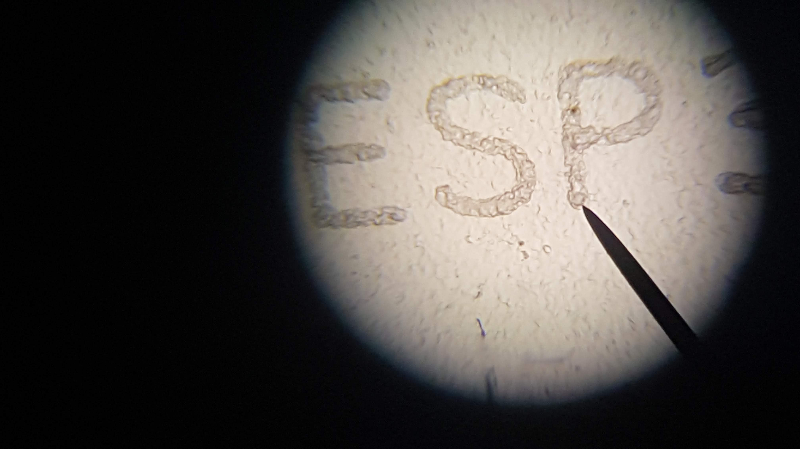
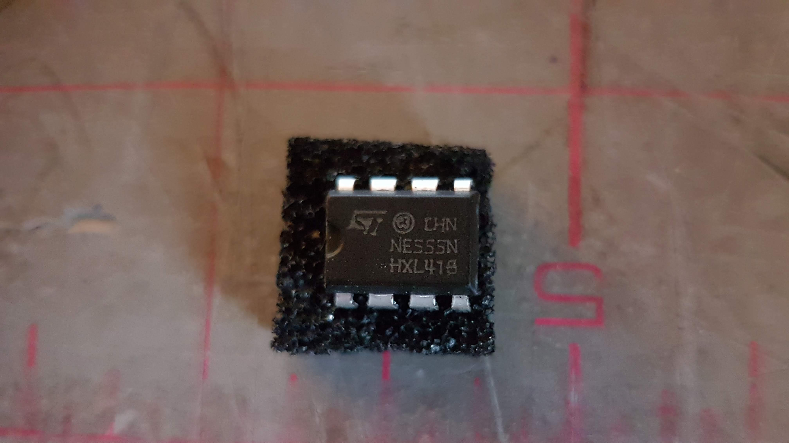
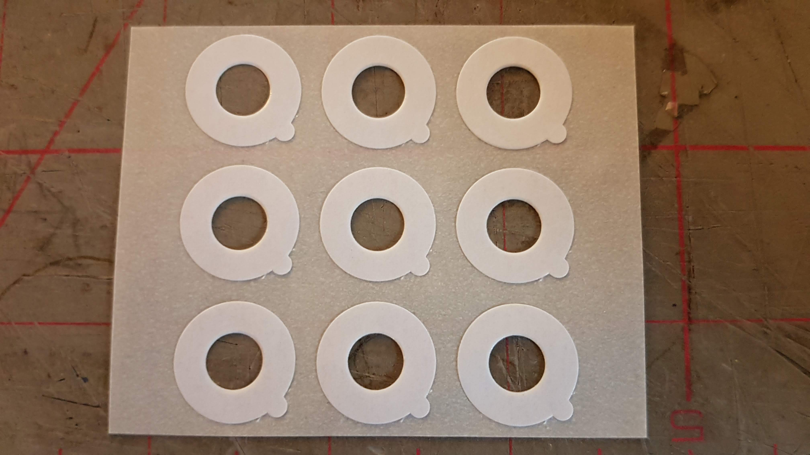
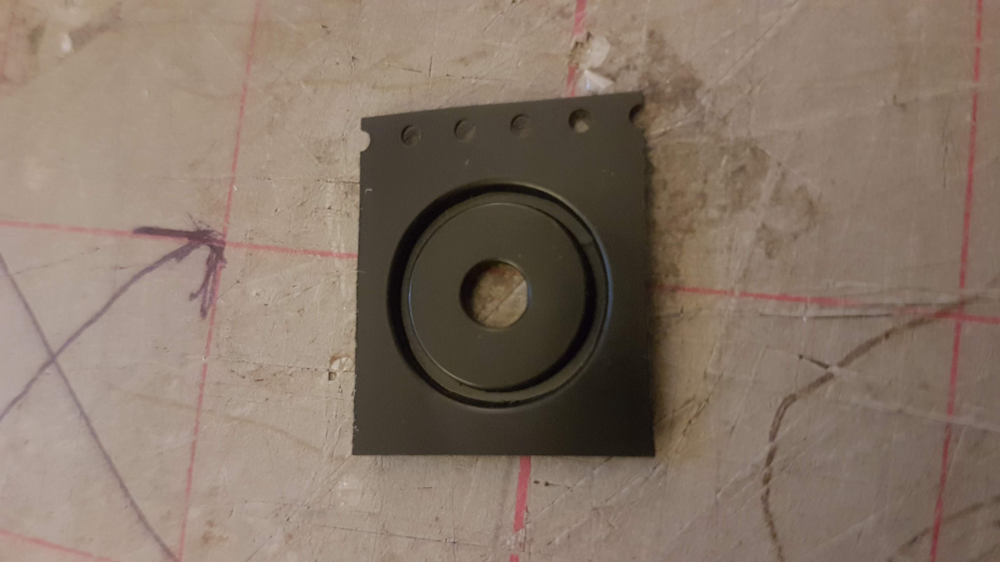
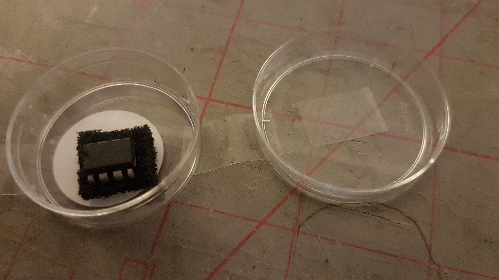
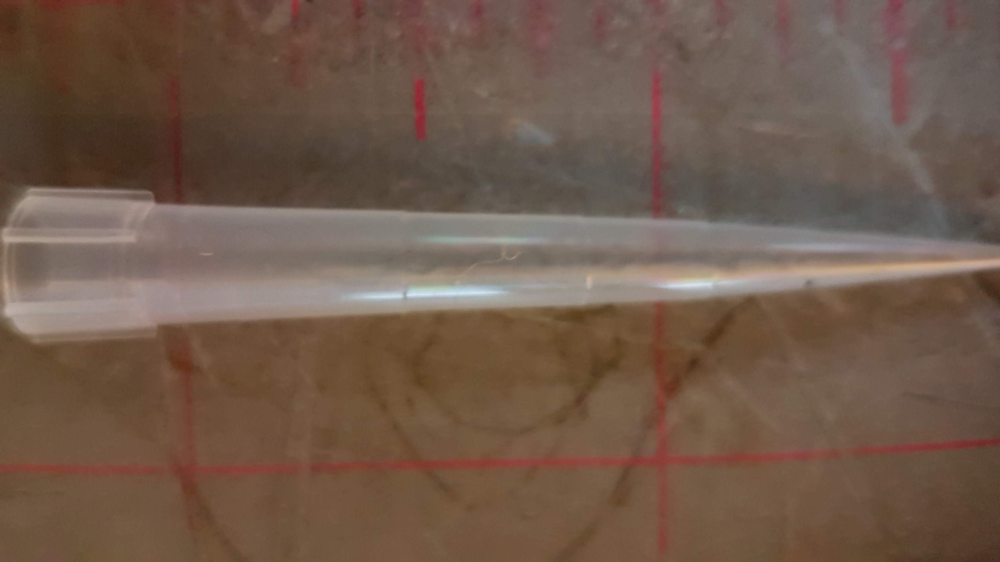

## Lab-From-A-Chip

Lab-from-a-chip is a family friendly DIY intervention in Lab On A Chip technology using model organisms inspired by Science and Technology studies and scientific practice and part of Ross Dalziel's PhD research Critical Kits at the [Division for BioMedical Life Sciences at Lancaster University](https://www.lancaster.ac.uk/biomedical-and-life-sciences/) and makerspace [DoESLiverpool](https://www.lancaster.ac.uk/biomedical-and-life-sciences).

*"A* ***lab-on-a-chip*** *is a device that integrates one or several laboratory functions on a single integrated circuit of only millimeters to a few square centimeters to achieve automation and high-throughput screening."* via [Wikipedia](https://en.wikipedia.org/wiki/Lab-on-a-chip)

## Features

 * Hard silicon timer chips, the logical oscillators that make the world tick!
 * Stretchy silicon!
 * Lithium!
 * Microscopes!
 * Vinyl records!
 * Diodes!
 * Creatures that move like animals but eat like plants!
 * Making moulds from the capitalist ruins!

 This world and it's related fields of engineering of pico, nano and microfluidics can be hard to get into. Engineering structures only a few tens of microns high are hard and expensive to make. This project tries to take a playful approach to fostering agency and embodied thinking about this technology and bringing silicon and big living collaborating proteins together.

 We realised we are already surrounded by exotic objects that are made of very small engineered structures: the tiny logos etched onto integrated circuits in our phones or humble doorbell, or the tiny grooves of a vinyl record. All you need is some Polydimethylsiloxane (PDMS) a *silicon polymer* that is inert, non-toxic and optically clear to use these exotic objects to manipulate living organisms.

 [Mikroskopisk PacMan](https://youtu.be/GvZm9EXqrdU) Erik Andrew Johannessen's high end microfluidics game is worth looking at for a playful exploration. Check out the [full video here](https://www.youtube.com/TVxNvWCTbYo) and read the [Vice article](https://www.vice.com/en_us/article/vv7zba/pac-man-inspires-norwegian-researchers-to-better-study-microorganisms) if you like that kind of thing. Back in the 1960s when the military funded the shrinking of transistors nobody thought they'd use it for fun with ghosts, stories and pictures of cats, just bombs and tracking communists, but just look at the weird cultures that turned into! I wonder where microfluidics will take us? Should we be even doing this? What knowledge and 'goods' does it make?

### Getting started

#### Make A PDMS Mould

* Get a small blob of `A` PDMS in cover of the petri dish (the shallow side)
* Get a small blob of `B` PDMS in cover of the petri dish
* Mix together with edge of a paper slide from the foldscope net.
* Dip the `555` timer chip gently top first into the mix. Remove excess.
* Brush some PDMS mix onto the vinyl record
* Leave to dry
* Cover the `555` timer with the deeper side of the dish to avoid dust.

#### Quick Foldscope Assembly :microscope:

We are going to do a quick build of a  [Foldscope](https://www.foldscope.com/) Prakesh Labs ingenious bit of microengineering for frugal science.

1. Open up your foldscope kit and open the instructions. We are going to just build the lens stage and focus ramp, a minimal build to look at some algae and make moulds and connect to our phone cameras. Steps 1 - 6, and step 10. of the **ASSEMBLY INSTRUCTIONS**
   1. Insert coupler into Lens stage
   1. Insert another coupler into the reverse of the stage
   1. Fold and lock the bottom flap
   1. Insert lens into the Lens stage.
   1. Fold the Focus ramp
   1. Insert ramp into stage
   1. Fold the bottom of the Lens stage.

#### Connect to phone. :phone: :camera:

Refer to **Phone View** in **VIEWING** section overleaf.

1. Take the round white double sided peel off sticker and stick it carefully over your phone camera lens, make sure you dont get the glue on the lens. It comes off with water if you do :smile:

1. remove the white cover. Now theres a sticky side facing up.

1. Take the other coupler and place it silver side down over the lens. Keep the lens central to the couplers hole.

#### Slide prep :bug:

1. Carefully with tweezers peel off the cured PDMS from your `555` timer chip in the petri-dish and place it so where it came into contact with the surface is flat on the surface of the slide, in the centre of the glass with the slide logo ledgible

1. Take a micropipette and place the long tip from your kit on the end.
1. Press and hold the button/plunger.

1. Get a friend to open and hold the 1.5ml Eppendorf tube with the algae suspension inside.
1. Insert tip into the Eppendorf tube
1. Release the plunger, it will have captured the number of micro litres indicated on the pipette of algae suspension
1. place the tip by the side of the tiny section of silicon.
1. Press the button to eject the algae suspension, it should find it's way under the PDMS slab by capillary action
1. Peel off the clear sticky cover slip and place over the slab. If your slab is too thick, dont bother.

#### Viewing :eyes:

1. Open & hold the rear flap, so the yellow side of the stage faces up
1. Take your prepared slide and place cover slip or slab down over the tiny bubble of the ball lens.
1. Let the bottom lens stage flap magnetically snap to hold the slide in place.
1. Carefully turn over keeping slide in place. Use stickers if it slips. The blue side should face up
1. Slide the focus ramp out so the `Z` mark on the stage lines up with the `0` on the focus ramp rule.
1. Place on the desk with silver of coupler facing up
1. Turn on your phone camera and slowly approach the coupler, the magnetic force whould make the stage jump up onto your phone.
1. Watch and explore! Check your mould is in place, experiment with the focus and move around toward the light. Face a window or light or use the LED & Battery

### Background :computer:

Lab on a chip tech builds an interesting 'public imaginary', a narrative for both layperson and specialist, as a form of biological or chemical manufacturing akin to the so called silicon 'revolution'.

Like Integrated circuits they are very small environments for manipulating and interpreting the behaviour of matter. Like their silicon cousins they generate alot of hype, hope, fear, hard cash and financialisation and hopefully something 'good'.

Unlike these circuits, lab-on-a-chips manipulate much bigger things than electrons, big, scary molecules just as weird as any tiny quantum packets, but so complicated it can make your head spin as fast as an accountant at the Large Hadron Collider: big proteins like DNA, bioassays and super collaborating symbiotic mega-communities which have the added complication of not only ***being alive*** but containing mind boggling histories encoded inside every part of them.

### Theoretical Repertoire :book: :package:

I've been trying to develop a form of `critical-kit-making-as-method`

I try to build up some king of theoretical repertoire for tuning into what might be going on across various forms of biological knowledge production, then use this repertoire to make kits, a kind of `critical-making`. These kits then become handy boundary objects for exploring further and more intimately, growing the repertoire, making more kits with more people and so on.

I review by reading and making, making and reading

 * Review a range of kit and kit like practices that condense into a [Library of kits](https://domesticscience.org.uk/criticalkits/Library.html), a kit literature.
 * Briefly review literatures of the history of the philosophy of science in response to practices and kits I make with people.
 * Review literatures in STS Method, structured by emerging kits.

 With this repertoire and armed with my boundary negotiating kits:

 * Observe Craft practices in teaching microbiology undergraduates at the Division for Biomedical Life Science at Lancaster University
 * Observe me making kits with researchers and students
 * Making kits and facilitating activity based on them in makerspace DoESLiverpool and other sites in the worlds related to my art practice.

## Imaginaries

Lab on a chip is a powerful idea that includes many complicated imaginaries:

 * Scalable distributable labs that work on their own
  * Labs can work 'anywhere'
  * Labs are small but powerful
  * Myths of new biological computers made by existing biological computers
  * These are like kits: they package up some bio processes and make them super mobile and easy

## Making Lab On A Chip DIY

Leaving the term aside, what these chips really depend on is microfluidics, a parallel to electronic circuits but smaller yet slower.

When you try to teach microfludics you need to get a sense of Scale
Im experimenting with DIY microfluidics to

* Teach what microfluidics really are away from the master hyperbolic sales talk of Lab on A Chip.
* Provide agency so other actors can take advantage of the field

## Other Interventions

Helen Pritchard's [Critters on a chip](http://www.helenpritchard.info/artworks-projects/critter-compiler-prototype-2016)
