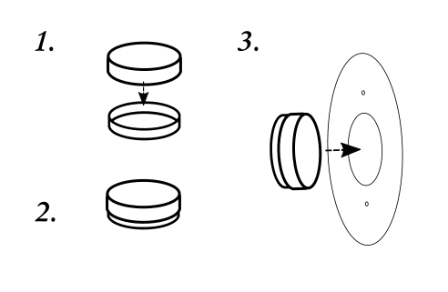
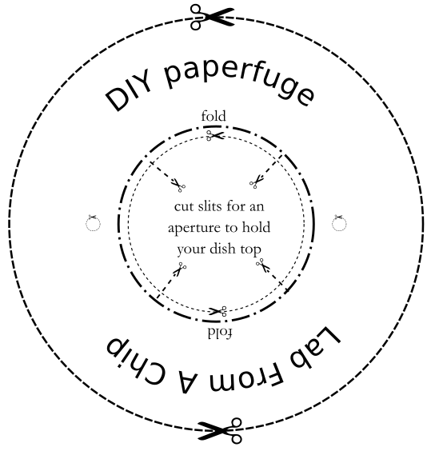
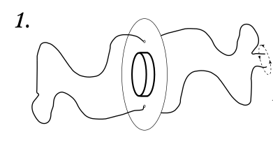
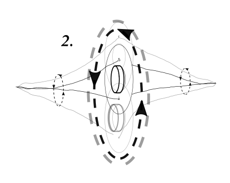
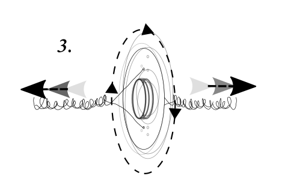

# DIY Paperfuge

Another Prakash Lab project, the makers of your Foldscope, is the Paperfuge, an "ultra-low cost, light-weight, field-portable centrifuge" based on the physics of a whirligig childrens toy. Our DIY version won't reach speeds of their design; but like our mould making, is 'just-good-enough' to let us follow a craft techniques in science. 

Recently some of their community used a [Dynamo torch](https://www.ebay.co.uk/itm/Pack-Hand-Pressing-3LED-Crank-Power-Dynamo-Wind-Up-Flashlight-Torch-Light-New/263717065208) using the mechanism to make the [Handyfuge](https://github.com/ethanjli/handyfuge). We're looking into remixing Bioengineer Ethan's design to fit our mini petri dishes as we'd get much faster spinning speeds. 

A centrifuge is a key tool in seperating the different parts of a solution like blood, cultured organisms or pond water. It's also a key part of preparing biological assays for [PCR](https://en.wikipedia.org/wiki/Polymerase_chain_reaction) or [LAMP](https://en.wikipedia.org/wiki/Loop-mediated_isothermal_amplification) diagnoses. 

Once you've mixed your PDMS carefully secure the lid (it's the bigger part) with the sellotape included, cut out the paperfuge design & push into the middle of the cut folds in your 'fuge & tape securely in position.

## Cut out and make your Paperfuge 

Once you've mixed your PDMS, and before impressing our chip or vinyl fragment we will try to use the spin of the motion of a whirligig, the paperfuge. as a centrifugal force to 'push' the mix to the sides to make it nice & thin & even. 

Ideally we would assemble all our components in a dust & microbe free environment so we only see in the microscope what we might expect to see. For us, strange artefacts or particles from the unique histories of our moulds are encouraged!  

_Read the original Paperfuge research paper [here](http://dx.doi.org/10.1101/072207)_

Now thread the twine through the holes as below & tie off with a knot

Hold each end in front of you & start letting the disc rotate in front of you so that the twine starts to twist into a helix, it takes quite some time keep going! 
 

Once twisted quickly pull the bunched up helix outwards to the side & watch it spin! The bigger the twist the faster your spin! Try it a few times before you make your vinyl or chip impression and set

