## Welcome! ⚠ ️

Warning: This project takes time!

You now have a genuine foldscope kit with some extras to help you experiment in DIY microfluidics.

## Preperation: Foldscope Assembly & Testing ⚙️

The first thing to do is to assemble your Foldscope. This takes some practice to get everything assembled and be comfortable viewing something.

Fully fold out the included colour cardboard net; this contains all the foldscope components that you 'pop' out of the net and fold together with the magnetic lens couplers and lenses in the bubble wrap envelope. Unfold the instruction booklet and read both sides and follow the instructions to make your foldscope.

There is an [online user guide](https://www.foldscope.com/user-guide) and [series of tutorials](https://www.foldscope.com/tutorials) on the official Foldscope website and their YouTube channel especially is super helpful.

We've included a ready made glass microscope slide for you to 'test' your foldscope so make sure once assembled you [watch the glass slide tutorial](https://www.youtube.com/watch?v=z4qLuXhI3pI) to help you test the microscope. The slides are labelled and the sample is randomly chosen from an amateur biologist's collection, typical of the slides you might find in a beginners or children's microscope kit, but ready to view and some of them even stained to help you see the structures. If you can resolve a clear image of this slide and take a picture on your smartphone camera then you are ready to start making your own slides with PDMS moulds.

## 📲
## Phone Viewing

We have found that the [Phone Viewing Method](https://www.youtube.com/watch?v=0iRCceGCGus&feature=youtu.be) is the best way to to get images which isn't really made clear on the official guidance. You **can** hold it up to your eye and day light but really many of us love sharing our images with a phone so we'd like you to try get used to that.

There's a helpful [video tutorial](https://www.youtube.com/watch?v=hDIBLYLK_kg) that's well worth checking out.

We've also found resting on a desk and tilting the phone with the 'scope attached up to light reflected from your desk or laptop is enough illumination

We suggest phones to do most of our viewing as we use glass slides in this add-on kit. Holding it up to your eye with potential glass chippings from accidents handling glass slides is risky, and besides using your phone means you can video and take images easily and keep your slide still to help see our algal companions.

It's worth noting aswell that the original [Foldscope Academic Paper](http://arxiv.org/abs/1403.1211) imagined the Foldscope could be a xenodiagnostic tool to identify host/parasites in blood and urine samples, or do haemocytometer counts, so viewing such samples at a safe distance with a phone is a good idea.

 The foldscope works with glass slides really well in addtion to the paper slides included in the foldscope pop-out 'net' where you assembled all your foldscope components.

Below is a fast and dirty assembly of the foldscope if you're in a rush to get going. Practice capturing images before you make your first moulds though!

## Fast & Dirty Quickstart: Foldscope Assembly ⏩🔬

1.  Open up your foldscope kit and open the instructions. We are going
    to just build the lens stage and focus ramp, a minimal build to look
    at some algae and make moulds and connect to our phone cameras.
    Steps 1 - 6, and step 10. of the **ASSEMBLY INSTRUCTIONS**
    1.  Insert coupler into Lens stage
    2.  Insert another coupler into the reverse of the stage
    3.  Fold and lock the bottom flap
    4.  Insert lens into the Lens stage.
    5.  Fold the Focus ramp
    6.  Insert ramp into stage
    7.  Fold the bottom of the Lens stage.

## Back in Time ⌛

When microscopes were first used people did not know what they were looking at; what was a new organism or an artefact of the lens or a tiny lump of grease from a finger? Early geneticists, long before they imagined 'seeing' a gene, would often ban them from the laboratory as unreliable. We've come a long way.

In many ways the foldscope puts us back in time as we struggle (and it can be!) to see something. However you'll be surprised just how much you actually tacitly 'know' about what you are looking at. You'll intimately 'know' when you see the algae or a plant cell sample. Unlike laboratory 'scopes' your tiny hand movements and fiddling with your phone are very visible, you actually get to 'feel' when you are seeing something. This is a bit like Ian Hacking's idea of 'Intervening'; we 'see' with microscopes partly because of this awareness of how we are interacting with the sample.

>Remember, with microscopes we are mainly seeing light being **refracted** 'through' an organism when in our world we only ever really see light reflected off the surface of an object.

## Foldscope Ready 🔬

Once you have managed to successfully view the included sample glass slide in the foldscope and got to grips with the phone view, check out your Lab From A Chip booklet.

Below are additional notes to complement the instruction booklet included in your Foldscope kit bag.

Your kit should include, in addition to the foldscope, [this inventory of components](#inventory)

### PDMS Slide prep 💉💉

You should now be fairly confident you can image things with the Foldscope and take an image with your phone. 

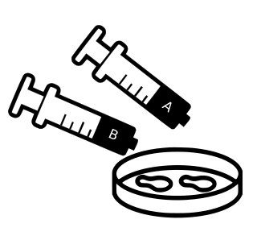

Inject equal amounts (0.5ml) of silicon from syringe A and fixer from syringe B into the 'floor' your mini petri dish (it's the smaller diameter part)

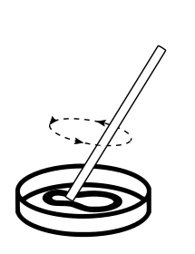
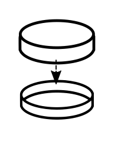

Mix well and add lid

## Making An Impression 📥⌛

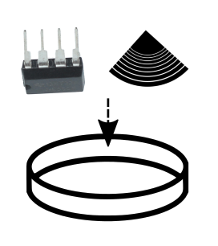

You now need to make an impression in the PDMS mix after mixing and spinning. To do this take your black viny fragment or `555` timer chip and with tweezers gently place grooves (if you're using a vinyl fragment) or the chip logo (if using the chip). Press it gently into the mix and you'll end up with a 'slab' of silicon with the impressions of the record grooves or the chip surface when it sets. This is tricky, press too hard and your section of PDMS is too thin to remove in one piece with the grooves or chip markings once it hardens. Usually just resting it in the mix is enough providing you dont drop or move the petri dish too much after.

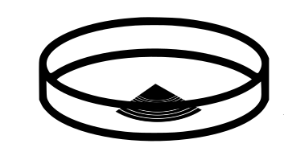

Now you need to wait and let it set! This can take, depending on thickness, up to 48 hours at room temperature but we've found just leaving overnight is fine

## Tips

### Temperature

In a warmer place or in sunlight it's alot quicker, some suggestions of heating to 70 degrees Centigrade estimate fully setting in 2 hours.

We `**DO NOT**` recommend heating, anything over 70 degrees and your petri dish will melt. In our case also, using the vinyl fragment, it is safest to just leave it in warm room overnight, You really `**DO NOT want under ANY circumstances to heat your vinyl fragment**`. Vapourising or burning vinyl releases toxic chlorine fumes that even in tiny amounts inhaled can be extremely dangerous and deadly.

### Other Techniques

You can of course make more impressions in other containers with the `A` & `B` mix.

While you wait practice with your foldscope and experiment viewing your algae and other things without your PDMS slab. The paper slides and plastic clear coverslip stickers provided also are worth experimenting with. 

### Bubbles

There is another step when making microfluidic moulds, making a vaccuum in a degassing chamber to remove any bubbles. For us this is too difficult; although there are plenty of nice DIY vacuum chamber designs out there, [This DIY chamber is our favourite](https://www.youtube.com/watch?v=k-64AgZp9OE) but we've found you can get ok results without this, the bubbles tend to leave naturally and don't reallly affect our results as we don't mind a few bubbles in our images, they might be intersting objects for the algae to swim around.

## Removing and Placing our PDMS slab🥢

After leaving your 'slab' of PDMS in the petridish overnight we need to carefully remove it. So we need to carefully remove the fragment from the mix. Now cut, preferably with a scalpel or very sharp fine knife, (sorry we can't include that) the 'slab' with our impressions in them and very carefully scrape it from the dish surface with a tiny flathead screwdriver then lift it with your included tweezers.

Now carefully place it impression down onto the glass slide. If it breaks (which it often does!), dont worry! get what you can onto the slide.

### Tip
Always be making extra slides for next time! The chips and vinyl can be re-used, just peel out the unused silicon. You may want to find other petri dishes or similar containers

## Placing Our Algae in Our PDMS Slide🐛

Get your disposable micro-pipette and capture a drop of algae, being careful not to spill the remaining algae culture.

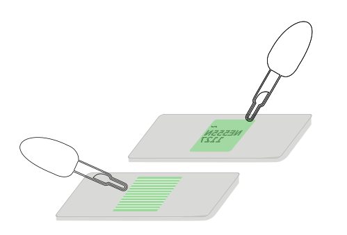

Use the micro disposable pipette to inject a drop of the algae suspension into and under the side of the impressed silicon and dont worry about excess liquid around it. Capilliary action should pull the liquid and our algal friends into the gap between the tiny impressions of the chip surface markings or the vinyl channels and the microscope slide.

Now carefully add a cover slip over the top and the excess liquid should help it stick to the side. You can get results without a cover slip if you find that your slab is too thick; but you can rub the slab off the slide if you move it around the lens too much.

## Fixing to the foldscope.

You want the cover slip on the top of your slide or the slab to face the ball lens on the yellow underside of the 'scope. You can unfold the magnetic section and then when you can see your sample is over the lens, let it snap back and this is often enough to keep your sample in place when viewing

You can also use it without the full foldscope frame; a minimal setup for use with the phone view as below

### Fixing more securely

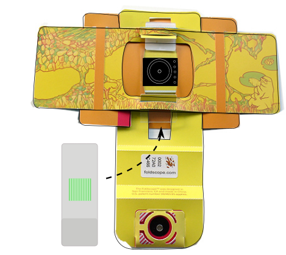

You can insert it more securely than in the minimal Foldscope build following in diagram above

Make sure you have got used to inserting and securing a glass slide into the Foldscope. When first doing it it's really difficult, the Foldscope coated paper is surprisingly resilient; you'll need to stretch the slots by inserting and removing a clean slide in and out of the slots of the paper platform so you can move it around easily to find and focus your slide and PDMS slab. It takes practice and some skill.

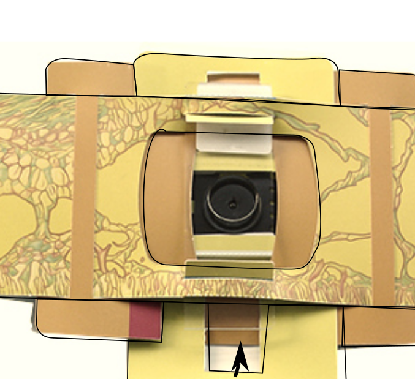

If you've made a nice slim PDMS impression we have found it useful to gently place a glass coverslip over the slab and algae suspension, then allow capillary action again by pressing very gently to secure the slip to the slide. You might see little 'rainbows' on the slide if it's secure, called Newtons rings.

If its really thick you can easily break the coverslip and this can make tiny dangerous glass fragments, so it is possible to view the slab without especially if working with young children

Insert your prepared slide into the Foldscope as below (be careful slotting it in not to push your PDMS slab or coverslip away)

### Cover slip Tip

We've found using a glass slide and glass cover slip only works well if your PDMS slab is super thin. In the lab, spinning in a centrifuge usually achieves this. We have no such luxuries of course so often a PDMS slab is too thick and the glass coverslip slips off. We found using the re-useable glass slide and the included clear plastic sticker coverslips work really well with thicker slabs. They are in the Foldscope plastic bag and you can peel them off; bend the backing sheet so you can lift off a corner of the clear coverslip stickers, then use tweezers to place over your slab and algae suspension and seal them in.

You can still lift up the sticker and add water if the suspension starts to dry up

### Algae death

You will find that the longer you use the slide our Eugelena will start to move slowly as the water suspension dries up, eventually killing our collaborators. There is not too much to do about this and for us it brings up close, the issue in much experimental biology and indeed biotic gaming, what are the ethics of observing, using, and killing model organisms? For uni-cellular life like algae with no complex nervous system it's a difficulty one can learn to accept, but we should think about what does it take for one organism to use another as a model, and for which organisms would this be unacceptable.

You can keep them alive longer by adding water or drop used slabs and coverslip stickers in a jar of water and left in sunlight occasionally allowing gas to exchnage they will happily multiply asexually and eventually form green algal blooms if you're lucky!

Waste and death of organisms takes place on a vast scale in microbiology, made worse by contemporary practices of often essential asceptic technique that use throw away plastic tips and tubes and petri dishes (which we use in our kit). Years ago re-useable glass was so much part of microbiological practice that every biology department had an in-house glass blower and it meant disinfecting and cleaning equipment was as important as inoculation. Crucially this is a part of the culture of re-use and care so important to the life sciences, that we could be losing.

## Get Exploring

That's it! You're ready! Now setup your phone with the Foldscope [as above](#phone-viewing) and see if our algal friends have found their way into the microfluidic channels. We've found that the vinyl record is the most rewarding, as you really get to see our *Euglena gracilis* moving along the grooves and you could try imagine how slow the music might sound like at their speed. With your phone setup you could try shining the LED included and see how they respond.

These organisms are mixotrophic in that they 'eat' proteins and plant matter but also photosynthesise, so like plants 'make' food from sunlight. They are like plants but also behave like animals.

Have a think what other ordinary stuff we have in our homes and workplaces that might have tiny spaces the size of record grooves or silicon chip logos? What about textiles? The surface of your phone or pair of running shoes/trainers/sneakers? An old pair of headphones? The surface of some wood or steel? Once you put yourself in the Algae's position the human engineered world becomes like a whole world.

You begin to realise the most ordinary stuff in our human engineered world is full of vast precision engineered space and constructions, weird artefacts of utility that at some point took alot of human care and often untold human and non-human cost

### Share Your Experience

Please post your images to twitter and copy @CriticalKits and @PrakashLab or Instagram @cheapjack @foldscope

### Taking part further

Finally if you'd like to take part in the CriticalKits research project please read and complete (don't forget to sign digitally! use an image or insert the text in italics) the [Participant Information Sheet (PIS)](https://github.com/cheapjack/LabFromAChip/raw/master/docs/PIS_Consent.docx) and send to <a href = "mailto:r.dalziel@lancaster.ac.uk?subject = Lab From A Chip Kit&body = My PIS sheet and consent">Ross Dalziel</a>

### Other Materials

You might like to try using other materials. One tip for making moulds on big surfaces that dont fit a little petri dish is to use rolled up plasticine to make tiny 'walls' for your mould, if you try paint the PDMS on, it just spreads too thinly otherwise!

Ideally you want little PDMS 'slabs' of 0.25mm thickness or less.

### Inventory

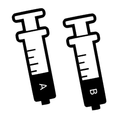

Prepared & labelled syringes filled with PDMS (A) & hardener (B). PDMS is a non-volatile silicon and safe to handle, but not ingest. We advise taking care to wash your hands thoroughly after use and store them in the already open plastic sleeves. Unmixed they store for up to a year. Be careful not to cross contaminate the A & B components or they will harden in storage.

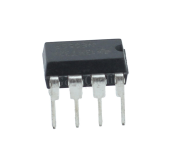

555 Timer chip. Common chip in maker projects. See https://github.com/DoESLiverpool/WearableTechBadgeWorkshop/blob/master/555Tutorials.md for what you can make with timers.

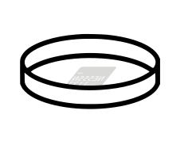

Micro-petri-dish with lid. Mix PDMS together and make impressions with chip surfaces. You could use anything you think might make tiny  impressions in the surface of your PDMS mould.

1.5ml Eppendorf with safe-lid containing an algae suspension of Euglena gracilis. You can see Euglena [in action here](https://youtu.be/ghMFiTQJU-M)  

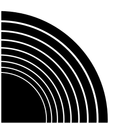

Vinyl fragment. Some of you may not remember, but at the dawn of pop culture and capitalism music was distributed widely on vinyl discs as micrometre scale grooves that could be amplified and played back

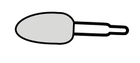

1.3ml Disposable micro pipette

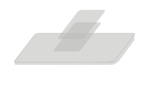

Blank glass Microscope slide with cover slips for your own PDMS mould. Take care with the glass cover slips

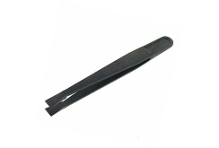

Plastic tweezers for removing your set PDMS impressions

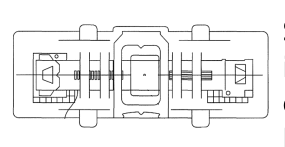

Standard Foldscope classroom kit, instructions, sticker set, lens cleaning q-tip, lighting stage and lens/phone assembly

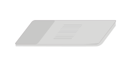

Pre-prepared PDMS with coverslip slide made from old vinyl record. This is to help you get started but you can make your own by 'painting' mixed PDMS onto your own records or other surfaces

**NOTE** This is only in later complete kits

Vinyl record Fragment. Some of you may not have a record collection and listen on big data infrastuctures like Spotify or YouTube or maybe if you care about artists getting paid, Bandcamp. You can't really get impressions from these sources although if you could access their server racks in the correct data centre you could find a hard drive that likely has some micro-engineered structures but you'd get in trouble!

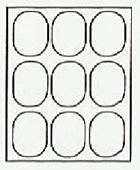
Cover slip stickers for those more awkward thick PDMS slabs and samples

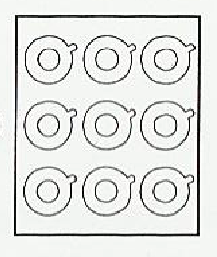
Phone stickers for fixing a magnetic lens frame to your phone camera

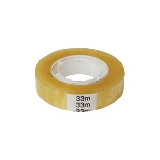

Easy tear sellotape for fixing your slide to the 'scope and securing your petri dish when using the paperfuge.

#### LED throwie

LED & Battery. For lighting up your *Euglena gracilis* Watch 'em go!

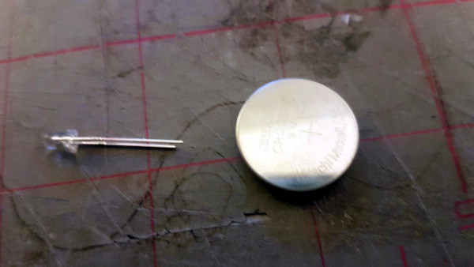

We've included an LED and battery which you can use for extra lighting with the help of your tape. You can also use them as an [LED Throwie](https://makezine.com/projects/led-throwies/) for guerilla LED graffitti on the macroscale.

*Euglena gracilis* are popular in the [field of Biotic games](https://biodigitalgames.com/). Use your LED to see if you can make the algae move in the direction you wantto see if you can make the algae move in the direction you want. If you look carefully you'll see their tiny red spot which is sensitive to light, they'll make their way toward the light as for them (like us) it's a source of food and energy  

