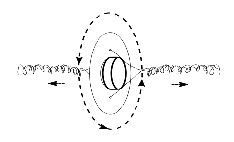

## Welcome!

Warning ⚠️ This project takes time!

You now have a genuine foldscope kit with some extras to help you experiment in DIY microfluidics.

## Foldscope Assembly

The first thing to do is to assemble your Foldscope. This takes some practice to get everything assembled and be comfortable viewing something.

We'll be using an included ready made glass microscope slide for you to test your foldscope so make sure once assembled you [watch the glass slide tutorial](https://www.youtube.com/watch?v=z4qLuXhI3pI)

There is an [online user guide](https://www.foldscope.com/user-guide) and [series of tutorials](https://www.foldscope.com/tutorials) on the official Foldscope website and their YouTube channel especially is super helpful.

Fully fold out the included colour net and read both sides then follow alongwith the YouTube videos above to assemble and use your foldscope.

## Phone Viewing

We have found that the [Phone Viewing Method](https://www.youtube.com/watch?v=0iRCceGCGus&feature=youtu.be) is the best way to to get images which isn't really made clear on the official guidance.

There's a helpful [video tutorial](https://www.youtube.com/watch?v=hDIBLYLK_kg) that's well worth checking out.

## Foldscope Ready

Once you have managed to successfully view the included sample glass slide in the foldscope and got to grips with the phone view, check out your Lab From A Chip booklet.

Here are some additional notes to complement the instruction booklet included in your Foldscope kit bag.

Your kit should include [this inventory of components](#inventory)

We also only use phones to do our viewing as we use glass slides in this add-on kit. Holding it up to your eye with potential glass chippings from accidents handling glass slides is risky, and besides using your phone means you can video and take images easily and keep your slide still to help see our algal companions.

Some of you may have included in the kit a random pre-prepared glass slide donated from a microscope enthusiast from the Wirral in Merseyside which is good to practice with. The foldscope works with glass slides really well in addtion to the paper slides included in the foldscope pop-out 'net' where you assembled all your foldscope components.

Below is a fast and dirty assembly if you're in a rush to get going. Practice capturing images before you make your first moulds though!

### Quickstart: Foldscope Assembly 🔬

1.  Open up your foldscope kit and open the instructions. We are going
    to just build the lens stage and focus ramp, a minimal build to look
    at some algae and make moulds and connect to our phone cameras.
    Steps 1 - 6, and step 10. of the **ASSEMBLY INSTRUCTIONS**
    1.  Insert coupler into Lens stage
    2.  Insert another coupler into the reverse of the stage
    3.  Fold and lock the bottom flap
    4.  Insert lens into the Lens stage.
    5.  Fold the Focus ramp
    6.  Insert ramp into stage
    7.  Fold the bottom of the Lens stage.

### PDMS Slide prep 🐛

Inject equal amounts (0.5ml) of silicon from syringe A and fixer from syringe B into the 'floor' your mini petri dish (it's the smaller diameter part)

Mix well and add lid

## DIY Paperfuge

[Assemble your DIY Paperfuge](DIYPaperfuge.md) and carefully spin your PDMS! It's best to have put to rest for 15 minutes after mixing while you prepare the 'fuge. If your unsure how to wind up the Paperfuge ready for spinning, have a look at this [DIY Whirligig Toy tutorial](https://www.todaysparent.com/family/crafts/how-to-make-an-old-school-whirligig-fidget-toy/) to get the idea of how to use it and follow the instructions on the paperfuge cut out included. You might like to decorate your 'fuge to make nice patterns while you spin.

## Making An Impression

You now need to make an impression in the PDMS mix after mixing and spinning. To do this take your black viny fragment or `555` timer chip and with tweezers gently place grooves (if you're using a vinyl fragment) or the chip logo (if using the chip). Press it gently into the mix so that you end up with a thin section of PDMS with the grooves or chip markings once it hardens.

Now you need to wait and let it set! This can take, depending on thickness up to 48 hours at room temperature. In a warm place it's alot quicker, some suggestions of 80 degrees Centigrade estimate fully setting in 2 hours.

We `**DO NOT**` recommend heating, over 80 degrees and your petri dish will melt. In our case using the vinyl fragment, it is safest to just leave it in warm room overnight, You really `**DO NOT want under ANY circumstances to overheat your vinyl fragment**`. Vapourising or burning vinyl releases toxic chlorine fumes that even in tiny amounts inhaled can be extremely dangerous and deadly.

You can of course make more impressions in other containers and skip the spinning step.

While you wait practice with your foldscope and experiment viewing your algae a nd other things without your PDMS slide.

There is another step when making microfluidic inspressionts, when you place the mix into a vaccuum to remove any bubbles. For us this is too difficult; there are plenty of DIY vacuum chamber designs out there, [This DIY chamber is our favourite](https://www.youtube.com/watch?v=k-64AgZp9OE) but we've found you can get ok results without bothering, the bubbles tend to leave naturally and don't reallly affect our results.

## Removing and Placing our PDMS slab

After leaving your 'slab' or PDMS in the petridish overnight we need to carefully remove it. So we need to carefully remove the fragment from the mix. Now cut, preferably with a scalpel or very sharp fine knife, the 'slab' with our impressions in them and very carefully lift it with tweezers, impression down onto the glass slide. If it breaks, dont worry get what you can onto the slide. Always be making extra slides for next time! The chips and vinyl can be re-used.

## Placing Our Algae in Our PDMS Slide

Get your disposable micro-pipette and capture a drop of algae, being careful not to spill the remaining algae culture

Use the micro disposable pipette to inject a drop of the algae suspension into the side of the impressed silicon. Capilliary action should pull the liquid into the gap between the tiny impressions of the chip surface markings or the vinyl channels and the microscope slide.

Make sure you have got used to inserting and securing a glass slide into the Foldscope. When first doing it it's really difficult, the Foldscope coated paper is surprisingly resilient; you'll need to stretch the slots by inserting and removing a clean slide in and out of the slots of the paper platform so you can move it around easily to find and focus your slide and PDMS slab. It takes practice and some skill.

If you've made a nice slim PDMS impression we have found it useful to gently place a glass coverslip over the slab and algae suspension, then allow capillary action again by pressing very gently to secure the slip to the slide. You might see little 'rainbows' on the slide if it's secure, called Newtons rings.

If its really thick you can easily break the coverslip and this can make tiny dangerous glass fragments, so it is possible to view the slab without especially if working with young children

Insert your prepared slide into the Foldscope as below (be careful slotting it in not to push your PDMS slab or coverslip away)

That's it! You're ready! Now setup your phone with the Foldscope and see if our algal friends have found their way into the microfluidic channels. We've found that the vinyl record is the most rewarding, as you really get to see our *Euglena gracilis* moving along the grooves and you could try imagine how slow the music might sound like at their speed. With your phone setup you could try shining the LED included and see how they respond.

These organisms are mixotrophic in that they 'eat' proteins and plant matter but also photosynthesise, so like plants 'make' food from sunlight. They are like plants but also behave like animals.

Have a think what other ordinary stuff we have in our homes and workplaces that might have tiny spaces the size of record grooves or silicon chip logos? What about textiles? The surface of your phone or pair of running shoes/trainers/sneakers? An old pair of headphones? The surface of some wood or steel? Once you put yourself in the Algae's position the human engineered world becomes like a whole world.

Please post your images to twitter and copy @CriticalKits and @PrakashLab or Instagram @cheapjack @foldscope

Finally if you'd like to take part in the CriticalKits research project please read and complete (don't forget to sign digitally! use an image or insert the text in italic) the [Participant Information Sheet (PIS)](PIS.docx)

### Connect to phone. 🤳 📷

Refer to **Phone View** in the **VIEWING** section of the main Foldscope instruction booklet.

1.  Peel off a round double sided sticker with white ring cover and stick it carefully over your phone camera lens, make sure you dont get the glue on the lens. It comes off with water if you do 😀. Rub it in place firmly with cover on so it bonds firmly to the phone surface around the lens. Peel off the white cover. Now theres a sticky side facing up with the camera aperture in the centre.

3.  Take the spare coupler and place it silver side down over the lens of the phphone, keeping the phone lens aperture central to the couplers hole. Press and smooth it fimly to the tape. It's a strong bond at this point between the phone surface and the coupler. Now we've a magnetic ring bonded to our phone.

Prepare a slide on the foldscope and place it on a table or desk in front of you. Now open your camera app and approach the foldscope aperture (blue side up) where you would hold it up to your eye. When you get close enough the coupler will pull the 'scope up to the magentic coupler and your auto focus will capture the image from the ball lens.

Focus by shifting the paper folded focus ramp left or right.

You can take it off again and replace it but after a few replacements the glue degrades.

If you setup near a window or open laptop this serves as a good overall light source but experiment with the included LED & battery, known in Maker circles as an LED throwie

# 🎥

There's a [handy video guide here](https://www.youtube.com/watch?v=0iRCceGCGus&feature=youtu.be&t=81)

#### LED throwie

We've included an LED and battery which you can use for extra lighting with the help of your tape. You can also use them as an [LED Throwie](https://makezine.com/projects/led-throwies/) for guerilla LED graffitti on the macroscale.

*Euglena gracilis* are popular in the [field of Biotic games]() Use your LED to see if you can make the algae move in the direction you wantto see if you can make the algae move in the direction you want. If you look carefully you'll see their tiny red spot which is sensitive to light, they'll make their way toward the light as for them (like us) it's a source of food and energy  

### Share Your Experience

Please post your images to twitter and copy @CriticalKits and @PrakashLab or Instagram @cheapjack @foldscope

Finally if you'd like to take part in the CriticalKits research project please read and complete (don't forget to sign digitally! use an image or insert the text in italic) the [Participant Information Sheet (PIS)](PIS.docx)

### Inventory

Prepared & labelled syringes filled with PDMS (A) & hardener (B). PDMS is a non-volatile silicon and safe to handle, but not ingest. We advise taking care to wash your hands thoroughly after use and store them in the already open plastic sleeves. Unmixed they store for up to a year. Be careful not to cross contaminate the A & B components or they will harden in storage.

555 Timer chip. Common chip in maker projects. See https://github.com/DoESLiverpool/WearableTechBadgeWorkshop/blob/master/555Tutorials.md for what you can make with timers.

Micro-petri-dish with lid. Mix PDMS together and make impressions with chip surfaces. You could use anything you think might make tiny  impressions in the surface of your PDMS mould.

1.5ml Eppendorf with safe-lid containing an algae suspension of Euglena gracilis. You can see Euglena [in action here](https://youtu.be/ghMFiTQJU-M)  

Vinyl fragment. Some of you may not remember, but at the dawn of pop culture and capitalism music was distributed widely on vinyl discs as micrometre scale grooves that could be amplified and played back

1.3ml Disposable micro pipette

Blank glass Microscope slide with cover slips for your own PDMS mould. Take care with the glass cover slips

Plastic tweezers for removing your set PDMS impressions

Standard Foldscope classroom kit, instructions, sticker set, lens cleaning q-tip, lighting stage and lens/phone assembly

Pre-prepared PDMS with coverslip slide made from old vinyl record. This is to help you get started but you can make your own by 'painting' mixed PDMS onto your own records or other surfaces

**NOTE** This is only in later complete kits

Vinyl record Fragment. Some of you may not have a record collection and listen on big data infrastuctures like Spotify or YouTube or maybe if you care about artists getting paid, Bandcamp. You can't really get impressions from these sources although if you could access their server racks in the correct data centre you could find a hard drive that likely has some micro-engineered structures but you'd get in trouble!

LED & Battery. For lighting up your *Euglena gracilis* Watch 'em go!

Easy tear sellotape for fixing your slide to the 'scope and securing your petri dish when using the paperfuge.
