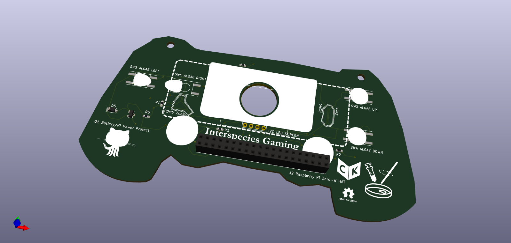

## Lab From A Chip PCB 💾🔬🧪

The Lab From A Chip Printed Circuit Board (PCB) is a prototype game platform and Critical kit made using *Interleaving Practices*, a methodology developed by artist Ross Dalziel in his PhD research project at LICA (Lancaster Institute for Contemporary Arts) and the Division for BioMedical Life Sciences at Lancaster University (BLS) and makerspace DoESLiverpool. It is an 'add-on' kit for the *Foldscope*, a folding paper microscope by Prakash Labs.

Like the main Lab From A Chip project it's a material critique of bio-technology by way of an intervention in the field of what makers and researcher's like Riedel-Kruse et al. (2011) call 'biotic gaming' and Lamers and van Eck described in their review of key examples, 'Why Simulate? Hybrid Biological Digital Games' (2012), where 'live organisms are an integral part of digital gaming technology or player experience'. It followed from preliminary discussions of the idea of *Interspecies Gaming* with artist Isabel Paehr at the Disrupt Encode Consilidate international symposium organised by Dalziel and his colleagues and supervisors Neil Dawson and Rod Dillon at BLS in 2018. 

The PCB is not a novel art-science-tech object but rather the by-product of learning through careful critical making exploring how maker culture and microbiologists both exploit and care for each other through technology, in the case of makers and the non-human, in the case of biologists.

