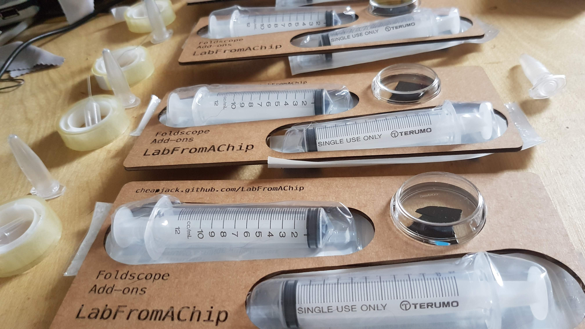
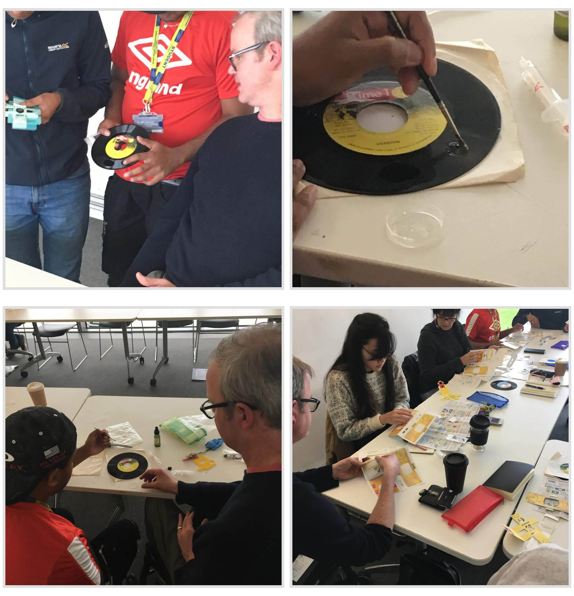

Lab-from-a-chip is a DIY intervention in Lab On A Chip technology using model organisms inspired by Science and Technology studies and scientific practice and part of Ross Dalziel's PhD research, Critical Kits at the [Division for BioMedical Life Sciences at Lancaster University (BLS)](https://www.lancaster.ac.uk/biomedical-and-life-sciences/) and makerspace [DoESLiverpool](https://www.lancaster.ac.uk/biomedical-and-life-sciences).

*\"A* ***lab-on-a-chip*** *is a device that integrates one or several laboratory functions on a single integrated circuit of only millimeters to a few square centimeters to achieve automation and high-throughput screening.\"* via
[Wikipedia](https://en.wikipedia.org/wiki/Lab-on-a-chip)

We include a standard Foldscope kit fresh from the [Foldscope Shop](https://www.foldscope.com/) and have included some extra materials to help you get started in the world of DIY microfluidics. We include a sample test glass microscope slide ready to use with your foldscope which can be assembled from the pop out net of coloured paper components.

## Getting Started

Go to [Getting Started](./GettingStarted.md) to get making!

## Features

-   Hard silicon timer chips, the logical oscillating workhorses that
    make the world tick!
-   Stretchy see-through silicon polymers!
-   Model Organisms, Biology's non-human collaborators!
-   [Leeuwenhoek](https://en.wikipedia.org/wiki/Antonie_van_Leeuwenhoek) Microscopes made of paper with lenses ground in China on a tape reel just like electronic components!
-   The redundant media of Vinyl records!
-   Critters that move like animals but eat like plants!
-   Making moulds in the capitalist ruins!

## Included

Item|Number|Source
---|---|---
Foldscope|1|[Foldscope Shop](https://www.foldscope.com/)
[PolyDiMethylSiloxane](https://en.wikipedia.org/wiki/Polydimethylsiloxane)(PDMS) Silicon|1|[EBay Shop](https://www.ebay.co.uk/itm/0-5kg-Clear-Electronic-Potting-Compound-PV-Solar-Cell-Encapsulant-PDMS-RV/323393673289)
2 pouches with syringes `A` & `B`|2|[EBay Shop](https://www.ebay.co.uk/itm/Terumo-Sterile-Syringes-Hypodermic-Luer-Slip-Syringe-1ml-2-5ml-5ml-10ml-20ml-30m/263962579871)
35mm Mini Petri Dish|1|[EBay Shop](https://www.ebay.co.uk/itm/10-Pcs-Laboratory-Plastic-Petri-Dish-Sterile-Cell-Tissue-Culture-Dishes-35mm/292809086404)
Glass Microscope slide|1|[EBay Shop](https://www.ebay.co.uk/itm/Professional-50-pcs-Blank-Microscope-Slides-Cover-Glass-Lab-Prep-ground-edges/283412415605)
Pre-prepared glass microscope slide|1|DoESLiverpool community
Instruction Booklet|1|cheapjack
Tweezers|1|[EBay](https://www.ebay.co.uk/itm/10PC-TWEEZER-SET-FOR-PRECISE-ELECTRONICS-MODELLING-JEWELLERY-BEADING-WIRE-WORK/173541962441)
Surplus electronic chip|1|[EBay](https://www.ebay.co.uk/itm/NE555-Timer-Chips-5-Pack-IC-PCB-Free-UK-P-P/231668892136)
7"/12" vinyl record fragment|1|Found in a flat in the Holly Street Estate, Hackney 1996

<!--Glass coverslips|3|[Ebay Shop](https://www.ebay.co.uk/itm/100-Glass-Micro-Cover-Slips-Glass-Blank-Lab-Coverslip-Microscope-Slide-Cover/164281210287)-->

## Bridging The World-To-Chip Barrier

This is part of Artist Ross Dalziel's art-science PhD embedded in the Division of Biomedical and Life Sciences at Lancaster University and makerspace [DoESLiverpool](https://doesliverpool.com), exploring critical making in kit cultures, *Critical Kits*. We're interested in what happens when you take a system from science and engineering, what Science and Technology Studies (STS) calls 'technoscience' and try to make it something that can be done outside of the "secluded research" (Callon et al. 2009. *Acting in an uncertain world : an essay on technical democracy* USA: MIT Press) of the science lab; how you could turn it into a DIY kit, what that entails and what that might mean.

We followed some diverse approaches to [DIY Microfluidics like this](http://fab.cba.mit.edu/classes/S62.12/people/tsai.liz/index.html), in our [Makerspace](https://github.com/DoESLiverpool/Wearables/wiki/Bio-Blog-2019#algae-microfluidics-doesliverpool) then began following the practices of microbiologist, researcher, biotechnologist and engineer [Alexandre Benedetto](https://www.lancaster.ac.uk/health-and-medicine/about-us/people/alexandre-benedetto).

Alex and his colleagues use the technique to observe the [organismal death process in *C elegans* model organisms](https://linkinghub.elsevier.com/retrieve/pii/S2211124718302316). Alex and his colleagues developed a mehtod using the grooves of old vinyl records as moulds for PDMS silicon which centrifuged and de-gassed, provides optically clear environments for securing nematodes for the observation of gene expression and other processes.

We take ideas from STS and feminist technoscience to make a [Theoretical Repertoire](./TheoreticalRepertoire.md) and develop a kit and workshop exploring model organisms in DIY environments made from discarded domestic electronics and media.

*"Microfluidic devices are an enabling technology for many labs,
facilitating a wide range of applications spanning high-throughput
encapsulation, molecular separations, and long-term cell culture. In
many cases, however, their utility is limited by a 'world-to-chip'
barrier that makes it difficult to serially interface samples with these
devices."*

(Longwell, Scott A, and Fordyce, Polly M. 2019. *micrIO: an open-source
autosampler and fraction collector for automated microfluidic
input--output* London Royal Society of Chemistry)

This world and it's related fields of engineering of pico, nano and microfluidics can be hard to get into. Engineering structures only a few tens of microns high are hard and expensive to make. Our project tries to take a playful approach to fostering agency and embodied thinking about this technology and bringing silicon and big living collaborating proteins (us humans) together.

We realised we are already surrounded by exotic objects that are made of very small engineered structures: the tiny logos etched onto integrated circuits in our phones or humble doorbell, or the tiny grooves of a vinyl record. All you need is some Polydimethylsiloxane (PDMS) a *silicon polymer* that is inert, non-toxic and optically clear to use these exotic objects to manipulate living organisms. What these chips really depend on is microfluidics, a development from electronic circuits but with things much bigger than electrons, the big molecules of chemistry and biology.

*"Microfluidic devices are powerful tools for biology, chemistry, and
medicine, with applications including biomolecular characterization,
cell encapsulation and culture, particle synthesis, and diagnostics. In
theory, their miniature scale allows a researcher to integrate processes
that span several lab benches into a single device with minimal cost and
sample requirements. In reality, the extensive infrastructure required
to convey reagents, samples, and analytes into and out of devices often
renders a 'lab-on-a-chip' more of a 'chip-in-a-lab"* (Ibid.)

Making this technology involves dust free environments, vacuum systems and expensive photolithography to get it done 'right'. But this usually does not stop the DIY 'maker' impulse. Even [Scanning Tunneling Microscopes (STM)](http://dberard.com/home-buit-stm) have gone DIY.  There is alot of open source work going on in the microfluidic community, not necessarily DIY, but I'm exploring how makerspaces can engage with it.

In experimenting with DIY microfluidics I hope to

-   Teach what microfluidics really are away from the master hyperbolic
    sales talk of Lab on A Chip.
-   Explore 'agency' and the power relations and subjectivities so other
    actors can explore the field
-   See what is going on in the technology

Make a *"frame for recovering the heterogeneous relations that technologies fold together...to be...re-enacted differently"* (Lucy Suchman, In Lury, C. and Wakeford, N. eds. (2012) Inventive methods: The happening of the social. London: Routledge. pp. 62-74.)
